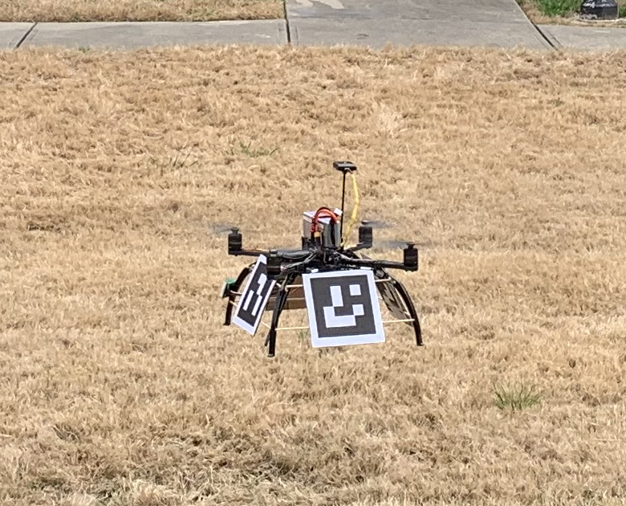
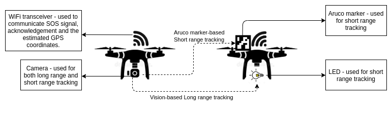
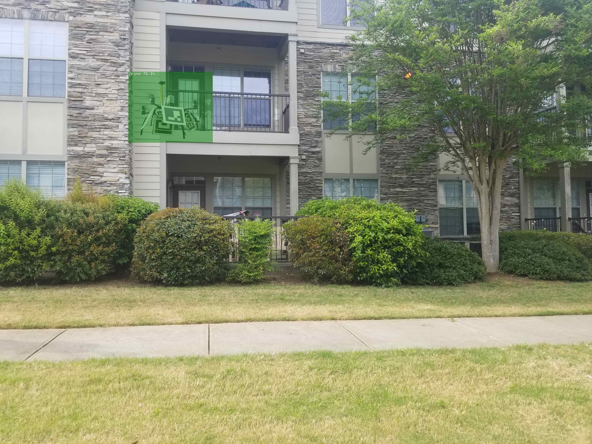
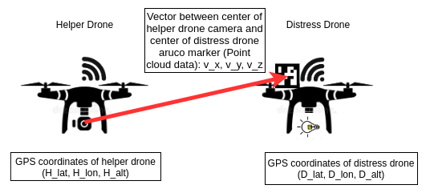

## IEEE VTS UAV Competition 2021 Team GSU

### Students

1. Harsh Gupta (he), Wheeler-Magnet High School, Georgia (joining Univ. of Georgia for UG studies in Fall 2021)
2. Bhawana Chagglani (she), Univ. of Massachusetts at Amherst (Graduate Student since Fall 2020)
3. Khadija Ashraf (she), Georgia State University (Ph.D. post-proposal candidate)

### Faculty Advisor and Project Contact
Dr. Ashwin Ashok (he), Assistant Professor in Computer Science, Georgia State University (http://ashwinashok.com)
Email: aashok@gsu.edu

## Overview

<p align="center">
 
</p>

We demonstrate a solution to achieve coordinated localization between two unmanned aerialvehicles (UAVs) using radio and camera based optical wireless communication. We propose to achieve the localization between the UAVs to address the problem of UAV GPS failure or its unavailability. Our proposed approach allows one UAV with a functional global positioning system (GPS) unit to coordinate the localization of another UAV with a compromised or missing GPS system. Our solution for localization uses a sensor fusion and coordinated wireless communication approach. 

## Hardware

We self assembled two identical drones using off-the-shelf available parts. This assembly builds a basic quad propeller drone and uses a MultiWi controller. Any other drone controller hardware is mountable (e.g. Pixhawk or ArduPilot etc). For more information on drone list of parts, please refer to the DroneMaterialsList.pdf document in this repository. Please contact us for a tutorial on assembly of the drone.

The additional hardware required on the drones will be a Jetson Nano 4GB, a ZED Stereo Camera, and I2C LEDs. It is also important to note that the drones will need to have GPS capability (install a GPS module) in order for this system to work. The Jetson Nano and the flight controller can be connected via a simple USB Type A to USB cable, and the ZED camera will connect to the Jetson via USB as well. 

The I2C LEDs will connect to the I2C Bus 1 of the Jetson Nano. The SDA port of the LED backpack will connect to pin 3 on the Jetson Nano, the SCL port will connect to pin 4, and the 5V power and ground can connect to any 5V and ground pins on the Jetson Nano. 

Refer to this link for the Jetson Nano J41 header pin diagram: https://www.jetsonhacks.com/nvidia-jetson-nano-j41-header-pinout/

## Installation

### Jetson Inference for Object (Drone) Detection



The Jetson Inference tool is used to run the object detection module of the system. This tool allows the user to use pretrained models for object detection, or to train their own models. This tool is used because it has been optimized by NVIDIA for the Jetson Nano. A thorough detailed guide for installing the Jetson Inferece project can be found at the following link: https://github.com/dusty-nv/jetson-inference/blob/master/docs/building-repo-2.md 

The condensed form of the commands required to build the project directly onto the Jetson (not inside a docker container) is as follows: 

```
$ sudo apt-get update
$ sudo apt-get install git cmake libpython3-dev python3-numpy
$ git clone --recursive https://github.com/dusty-nv/jetson-inference
$ cd jetson-inference
$ mkdir build
$ cd build
$ cmake ../
$ make -j$(nproc)
$ sudo make install
$ sudo ldconfig
```

### OpenCV

This project uses the the contrib version of opencv because it implements ArUco marker tracking. The easiest and recommended way of installing this is to use pip installation. This can be done by first installing pip: 

```
$ sudo apt-get install python3-pip
```

This will likely install an older version of pip. Since 19.3 is the minimum supported version for opencv, pip will first need to be upgraded. This can be done by running the following command, which should upgrade pip without any errors. 

```
$ python3 -m pip install -U pip
```

Once this is done, then opencv contrib can be installed for python using pip. The version used in this project is 4.5.1.48, but the latest version should work.  

```
$ python3 -m pip install opencv-contrib-python
```

Check that opencv is functional by importing cv2. If it returns an error, the following could be the issue:

Numpy and a newer version of protobuf are required in order to install a working version of opencv. The Jetson Nano comes with Protobuf version 3.0.0, but in order to install all dependancies of Numpy, Protobuf version 3.3.0 is required. The newer version of Numpy (1.19.5) will give a "Illegal Instruction (core dumped)" error when importing cv2. This issue can be resolved by installing Numpy version 1.19.4. In order to install these dependencies, run the following commands: 

```
$ python3 -m pip install protobuf==3.3.0
$ python3 -m pip install numpy==1.19.4
```
After installing these, reinstal opencv and check its functionaity by importing cv2.

This should correctly install opencv contrib and this can be checked by importing cv2. 

### ZED SDK for Jetson Nano

The ZED SDK will need to be installed in order to use the ZED Camera with the Jetson Nano. This can be done by downloading the latest version of the ZED SDK from the Stereolabs website under SDK downloads: 

https://www.stereolabs.com/developers/release/

Once the SDK has been downloaded, it can be made into an executable file by running the following command in the Downloads directory (or wherever the file has been downloaded). Note: If this command doesn't work, try replacing ZED_SDK_Tegra_JP44_v3.5.0.run with whatever the filename of the SDK is. 

```
$ chmod +x ZED_SDK_Tegra_JP44_v3.5.0.run
```

Then the file can be run using the following command: 

```
$ ./ZED_SDK_Tegra_JP44_v3.5.0.run
```

After installing the ZED SDK, recheck cv2, torch, and torch vision by importing them. ZED SDK installation can sometimes mess with the numpy version which causes opencv and torch errors. If that is the case, then the following should resolve it:

```
$ python3 -m pip install numpy==1.19.4
```

### Adafruit LEDs

LEDs are used to signify and visualize communication between the two drones. The Adafruit_Blinka library is used to control the LEDs or LED arrays due to its ease of use and reliable performance. In this particular project, the 8x8 LED matrix is used which has the ht16k33 controller. The python installation of the ht16k33 library is as follows: 

```
$ python3 -m pip install adafruit-circuitpython-ht16k33
```

### pyMultiWii

Multiwii serial protocol is used by many drone flight controllers in order to send and receive data. It is a light, generic, bit wire efficient, and secure form of communication between the flight controller and a computer like the Raspberry Pi or Jetson Nano. In this project, the existing pyMultiWii project has been expanded upon to include receiving GPS data from the flight controller. The pyMultiWii package can be installed for python by running the following commands: 

```
$ cd /ieee-vts-drone-competition-vtc2021/Full_System/pyMultiWii/
$ python3 -m pip install .
```

In order to initiate communication between the flight controller and the Jetson Nano, the following command must be run in order to resolve permission issues: 

```
$ sudo usermod -a -G dialout <username>
```

The pyMultiWii package should now work and can be tested by running the show-attitude.py file in the demo directory. Since this code has has no ```time.sleep()```, it's very fast and efficient. The output after running this file should look like this:

```
{'timestamp': 1417432436.878697, 'elapsed': 0.016, 'angx': -26.8, 'angy': -24.8, 'heading': -84.0}
{'timestamp': 1417432436.894663, 'elapsed': 0.016, 'angx': -26.8, 'angy': -24.7, 'heading': -84.0}
{'timestamp': 1417432436.910673, 'elapsed': 0.016, 'angx': -26.7, 'angy': -24.8, 'heading': -84.0}
{'timestamp': 1417432436.926812, 'elapsed': 0.016, 'angx': -26.7, 'angy': -24.7, 'heading': -84.0}
{'timestamp': 1417432436.942629, 'elapsed': 0.016, 'angx': -26.7, 'angy': -24.7, 'heading': -84.0}
{'timestamp': 1417432436.958657, 'elapsed': 0.016, 'angx': -26.7, 'angy': -24.6, 'heading': -84.0}
{'timestamp': 1417432436.974627, 'elapsed': 0.016, 'angx': -26.7, 'angy': -24.6, 'heading': -84.0}
{'timestamp': 1417432436.990591, 'elapsed': 0.016, 'angx': -26.7, 'angy': -24.5, 'heading': -84.0}
{'timestamp': 1417432437.006598, 'elapsed': 0.016, 'angx': -26.7, 'angy': -24.5, 'heading': -84.0}
{'timestamp': 1417432437.022676, 'elapsed': 0.016, 'angx': -26.6, 'angy': -24.5, 'heading': -84.0}
{'timestamp': 1417432437.038604, 'elapsed': 0.016, 'angx': -26.6, 'angy': -24.4, 'heading': -85.0}
{'timestamp': 1417432437.054619, 'elapsed': 0.016, 'angx': -26.7, 'angy': -24.4, 'heading': -85.0}
{'timestamp': 1417432437.070593, 'elapsed': 0.016, 'angx': -26.6, 'angy': -24.3, 'heading': -85.0}
{'timestamp': 1417432437.086576, 'elapsed': 0.016, 'angx': -26.6, 'angy': -24.3, 'heading': -85.0}
{'timestamp': 1417432437.102768, 'elapsed': 0.016, 'angx': -26.7, 'angy': -24.2, 'heading': -85.0}
{'timestamp': 1417432437.118586, 'elapsed': 0.016, 'angx': -26.6, 'angy': -24.2, 'heading': -85.0}
{'timestamp': 1417432437.134683, 'elapsed': 0.016, 'angx': -26.6, 'angy': -24.2, 'heading': -85.0}
{'timestamp': 1417432437.150524, 'elapsed': 0.016, 'angx': -26.6, 'angy': -24.1, 'heading': -85.0}
{'timestamp': 1417432437.166525, 'elapsed': 0.016, 'angx': -26.6, 'angy': -24.1, 'heading': -85.0}
```

## Usage

<p align="center">
  
</p>

This project is based on the scenario of several drones flying together as a fleet that connected via a Wi-Fi network, and it proposes a solution for failure of GPS system on a drone. Since automated flight is completely reliant on GPS coordinates, if a drone loses its GPS signal during automated flight, it is rendered completely helpless. This project proposes using computer vision and Wi-Fi communication to localize drones with GPS failure and assit them to the nearest checkpoint. The drone with a failed GPS system **(Distress Drone)** will be assisted by a drone that has a functional GPS system **(Helper Drone)**. The Helper Drone will locate the Distress drone within its camera frame and then compute the Distress Drone's GPS coordinates by using it's 3D position determined by the stereo camera and it's own GPS coordinates. The Helper Drone will first locate the Distress Drone using the long range object detection module, then it will fly closer to the Distress Drone until it is able to detect the Distress Drone's ArUco markers, and then it will send the calculated GPS coordinates to the Distress Drone via the Wi-Fi channel. 

In order to run this project, run the following commands on the Helper  Drone: 

```
$ cd /ieee-vts-drone-competition-vtc2021/Full_System/
$ python3 main.py
```

And then run the following command on the Distress Drone: 

```
$ cd /ieee-vts-drone-competition-vtc2021/Full_System/
$ python3 client.py
```

As soon as the files have been run, the LEDs on the Distress Drone will turn on. The LEDs will remain ON for 5 minutes which gives the researchers sufficient time for take-off and proper orientation. After 5 minutes, the LEDs will begin flashing rapidly which signifies that the Distress Drone is sending an SOS signal over the Wi-Fi channel and waiting for an acknoledgement. Once the Distress Drone has received the acknowledgement, the LEDs stay ON without blinking, and the Helper Drone begins flying closer together. Once the Helper Drone is close enough the the Distress Drone, it begins computing the Distress Drone's coordinates and sends them to the Distress Drone via the Wi-Fi channel. The Distress Drone's lights turn off, signifying that it is receiving coordinates from the Helper Drone. When the entire process is complete, the Distress Drone's LEDs flash slowly and the Helper Drone is clear to move away. 

## Acknowledgements
This research work is partially funded by the National Science Foundation (NSF) under the grant number CNS-1901133. The high-school student research is facilitated through the Georgia State University-Wheeler Magnet High School internship program.
